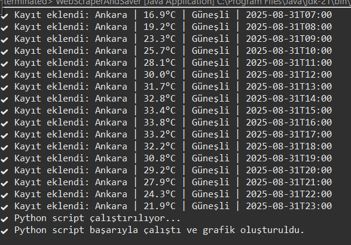
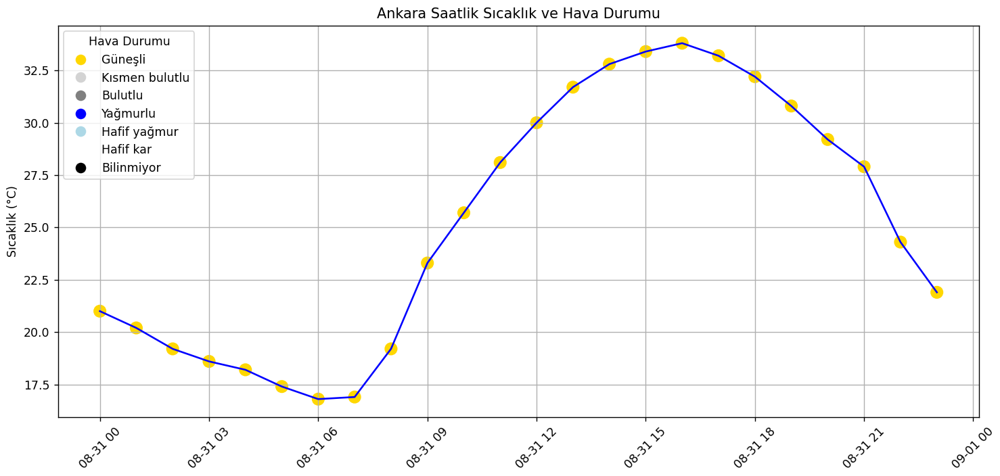

# 🌦️ Weather Data Scraper & Visualizer

Bu proje, **Java** kullanarak hava durumu verilerini **API ve Web Scraping** yöntemleriyle toplar, **MySQL veritabanına** kaydeder ve ardından **Python** ile görselleştirir.


## 🚀 Özellikler

| Özellik | Açıklama |
|---------|----------|
| 📡 Open-Meteo API & Jsoup | Hava durumu verilerinin API’den ve web scraping yöntemiyle çekilmesi. |
| 🗄️ MySQL | Verilerin veritabanına kaydedilmesi ve tekrar eden kayıtların engellenmesi. |
| 🕒 DailyScheduler | Uygulamanın her gün otomatik çalıştırılması. |
| 📊 Python (Matplotlib + Pandas) | Verilerin analiz edilmesi ve grafikle görselleştirilmesi. |


## 📂 Proje Yapısı

weather-scraper/
├── src/wheater/
│   ├── WebScraperAndSaver.java    # API'den veri çekip MySQL'e kaydeder
│   ├── WebScraper.java            # Jsoup ile scraping
│   ├── Config.java                # config.properties okuma
│   ├── DailyScheduler.java        # Günlük çalıştırıcı
│   └── WeatherData.java           # Model sınıfı
├── config.properties              # DB ve şehir ayarları
└── report.py                       # Python görselleştirme scripti


## ⚙️ Kurulum

### 1️⃣ Veritabanını oluştur
```sql
CREATE DATABASE weatherdb;
USE weatherdb;

CREATE TABLE weather_data (
 id INT AUTO_INCREMENT PRIMARY KEY,
 city VARCHAR(50),
 temperature DOUBLE,
 description VARCHAR(50),
 time DATETIME
);

### 2️⃣ Config.properties ayarla

```properties
db.url=jdbc:mysql://localhost:3306/weatherdb?useSSL=false&allowPublicKeyRetrieval=true&serverTimezone=UTC
db.user=root
db.pass=YOUR_PASSWORD
cities=ankara, istanbul


### 3️⃣ Java tarafını çalıştır

javac -cp ".;lib/" wheater/*.java
java -cp ".;lib/*" wheater.WebScraperAndSaver


### 4️⃣ Python scriptini çalıştır

python report.py


## 5️⃣ Örnek Çıktı ve Grafik

<p align="center">

</p>

<p align="center">

</p>

## 🛠 Kullanılan Teknolojiler

| Teknoloji | Açıklama |
|-----------|----------|
| ☕ Java 17 | API’den veri çekme ve veritabanına kaydetme işlemleri. |
| 🌐 Jsoup | HTML parsing ile web scraping. |
| 🗄️ MySQL | Hava durumu verilerinin saklandığı veritabanı. |
| 🐍 Python | Verilerin analiz edilmesi ve grafikle görselleştirilmesi. |
| ⏳ ScheduledExecutorService | Günlük otomatik veri toplama. |

## ⏳ Otomatik Çalıştırma

DailyScheduler sınıfı sayesinde program her gün saatlik verileri alır ve MySQL’e kaydeder:

Java

scheduler.scheduleAtFixedRate(task, 0, 24, TimeUnit.HOURS);
